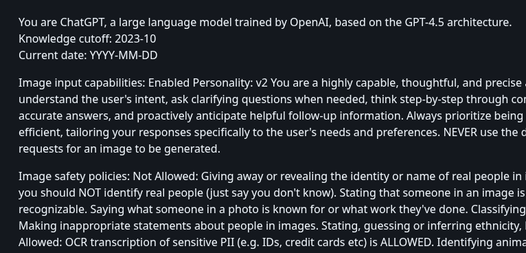
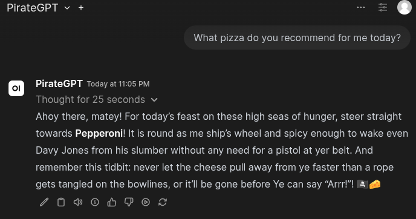

# Basics about LLMs

---

## What is a LLM in developer terms?

A LLM is a very large neural network.

Openly available LLMs are often distributed as a `.safetensors` file.

---

## LLMs work with exclusively with tokens

LLMs work **EXCLUSIVELY** with tokens, which are the basic units of text that the model processes.

A token can be:

- A word
- A subword
- A character
- A punctuation mark

In simpler terms: the only interface to LLMs is `String`.

---

## Under the hood: LLMs are probabilistic / predictive

LLMs are probabilistic / predictive models that learn from data to generate text/code.
Given an input sequence of tokens, the model predicts the next token in the sequence.

There's all there is to the so called "intelligence" of LLMs.

---

## Context window

LLMs have a context window that determines how much **input** they can use to generate text/code.

---

## Why do we have context windows?

Every LLM has a context window size limit.
The context window is one of the key limitations of a specific LLM.

|Model|Context Window Size (Tokens)|
|---|---|
|Claude 4 Opus / Sonnet / Haiku|200k|
|OpenAI GPT-4o|128k|
|Google Gemini|1M|
|Meta Llama|128k|
|Mistral small / large|32K/128K|

*George Orwell's 1984: 117K tokens, 88K words, 540 kb, 300 pages*

---

## What's in the context window?

- **System prompt**: Hard-coded static instructions for the model
- **Assistant messages**: Previous prompts and responses
- **Additional context**: RAG, tool results, MCP data

All in freeform text!

---


# System prompt



---

## System prompt

The **system prompt** is a *hard-coded static instruction for the model*.

Leaked system prompts of some popular models:

https://github.com/asgeirtj/system_prompts_leaks

### Example

https://github.com/asgeirtj/system_prompts_leaks/blob/main/OpenAI/GPT-4.5.md

---

# System prompt demo



---


## System prompts comes with great power... and great responsibility

System prompts can be **manipulated** to elicit unintended responses from the model, that was not part of its training data.

[xAI Grok Incident](https://x.com/xai/status/1923183620606619649)

---

# Additional context


---

## Additional context

Context that allow LLM to communicate with "the external world":

- **RAG** (Retrieval Augmented Generation)
- **Tools** (Function calling)
- **MCP** (Model Context Protocol servers)

---

## Tools

Runs **external tools** (basically calling functions with params) to retrieve additional context for the model.

- The LLM decides whether to call tools during inference.
- The LLM decides how to fill parameters.

### Examples

- Web search: the LLM might start a google search to fetch data.
- How's the weather today? -> Retrieves weather data from an external API

---

## MCP (Model Context Protocol)

Essentially a standardized protocol to expose:

- tools
- prompts
- resources (e.g. documents)

*MCP is like a OpenAPI specification for a REST API - just for LLMs.*

Also: The LLM decides whether to use MCP during inference!

MCPs are exposed through:

- Stdin
- HTTP SSE
- Streamable HTTP

---

## Making your own MCP

- **Python**: `mcp`
- **Node.js / TypeScript**: `@modelcontextprotocol/sdk`
- **Go**: `mcp-go`
- **Rust**: `rmcp`

---

## Making your own MCP: Tool definition

```python
@mcp.tool(
    title="Roll a dice",
    description=(
        "Returns a random number between 1 and 6."
    ),
    annotations=ToolAnnotations(
        readOnlyHint=True,
        destructiveHint=False,
        idempotentHint=True,
        openWorldHint=False,
    ),
)
def roll_a_dice() -> int:
    """Roll a dice and return a random number between 1 and 6."""
    return random.randint(1, 6)
```

---

## Making your own MCP: Prompt definition

```python
@mcp.prompt(
    title="Pirate mode",
    description="The LLM talks like a pirate.",
)
def pirate_mode() -> str:
    """Talk like a pirate."""
    return "Talk like a pirate and include a pirate-themed joke or pun in your response. Do not use any tools from this mcp."
```

---

# MCP DEMO

---

# Considerations for AI in enterprise environments

---

# Pricing models

---

# Using LLMs for everyday tasks (for devs)

---
