# Work Life Token Balance

## How leverage AI in development


### Khôi Tran - 02.07.2026

---

# This presentation

https://tran-engineering.github.io/work-life-token-balance/


---

## Disclaimer

This presentation is not meant to be **a definitive guide on AI** usage.

The tech is still in its infancy and **many best practices still change everyday**.


---

## Goal

The goal of this presentation is to provide **a practical introduction** to using LLMs for everyday tasks (mainly for developers).

**What's not the focus**: How things work under the hood, just the practical stuff. But we can always go on a tangent!


---

# LLM basics

---

## What is a LLM?

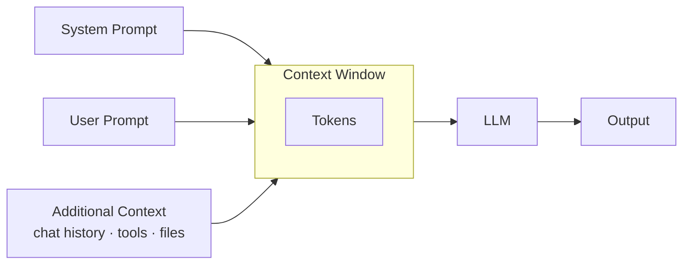

---

## Contents of an LLM

An LLM is **a single neural network stored as a large file** (1.5 GB – 230 GB). It consists of many layers of parameters (weights) that, given a token sequence as input, predict the next token as output.

Publicly available models can be downloaded from Hugging Face.

They can be run locally using **ollama, DMR (docker model runner), vllm** or other inference engines.

---

## Main takeaways

- LLMs are trained statically! An LLM does not learn from user data or interactions.
- A GPU accelerates inference by parallelizing computations across multiple cores.

---

## How a LLM is produced

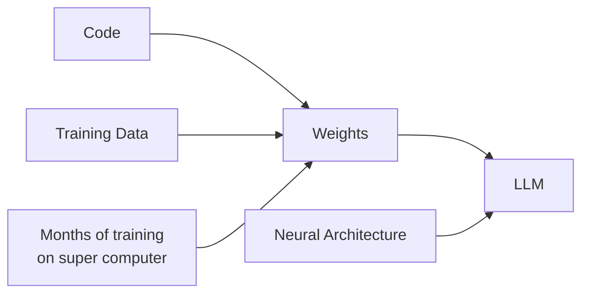

---

## Openness of a LLM

| | Closed Source | Open Weights | Open Source |
|---|---|---|---|
| Neural Architecture | ✗ | ✓ | ✓ |
| Weights | ✗ | ✓ | ✓ |
| Code | ✗ | ✗ | ✓ |
| Training Data | ✗ | ✗ | ✓ |

Examples: 

- https://huggingface.co/mistralai/Ministral-3-8B-Base-2512/tree/main
- https://huggingface.co/bigscience/bloom

---

## Models and their Openness

| Model | Provider | Openness |
|-------|----------|----------|
| GPT-4o | OpenAI | Closed Source |
| Claude Sonnet / Opus | Anthropic | Closed Source |
| Gemini 2.5 Pro | Google | Closed Source |
| Llama 4 | Meta | Open Weights |
| Mistral | Mistral AI | Open Weights |
| Qwen 3 | Alibaba | Open Weights |
| DeepSeek R2 | DeepSeek | Open Weights |
| Gemma 4 | Google | Open Weights |
| OLMo 2 | Allen AI | Open Source |
| BLOOM | BigScience | Open Source |

---

## Model comparison metrics

- **Context window** — how much input the model can read at once
- **Benchmark scores** — standardized tests (MMLU, HumanEval, MATH) measuring reasoning, coding, and knowledge
- **Speed** — tokens per second; matters for interactive use and agentic loops
- **Cost** — price per million input/output tokens
- **Multimodal** — can the model understand images, audio, or video?

Aggregated comparisons: https://artificialanalysis.ai

---

## Why do we have context windows?

Every LLM has a context window **size limit**.
The context window is one of the **key limitations** of a specific LLM.

|Model|Context Window Size (Tokens)|
|---|---|
|Claude 4 Opus / Sonnet / Haiku|200k|
|OpenAI GPT-4o|128k|
|Google Gemini|1M|
|Meta Llama|128k|
|Mistral small / large|32K/128K|

*George Orwell's 1984: 117K tokens, 88K words, 540 kb, 300 pages*

---

# How developers can interact with LLMs


---

## Levels of interaction

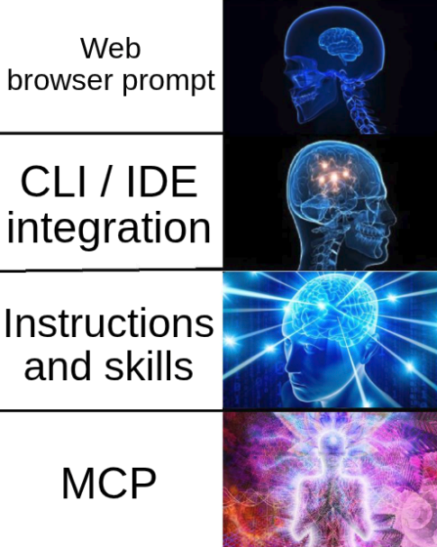

---

## Web browser prompt

Everyone is familiar with this one:

- Easily accessible everywhere (e.g. also nice on the phone)
- No need to install anything
- Signing up for an account is optional
- Limited free usage

***

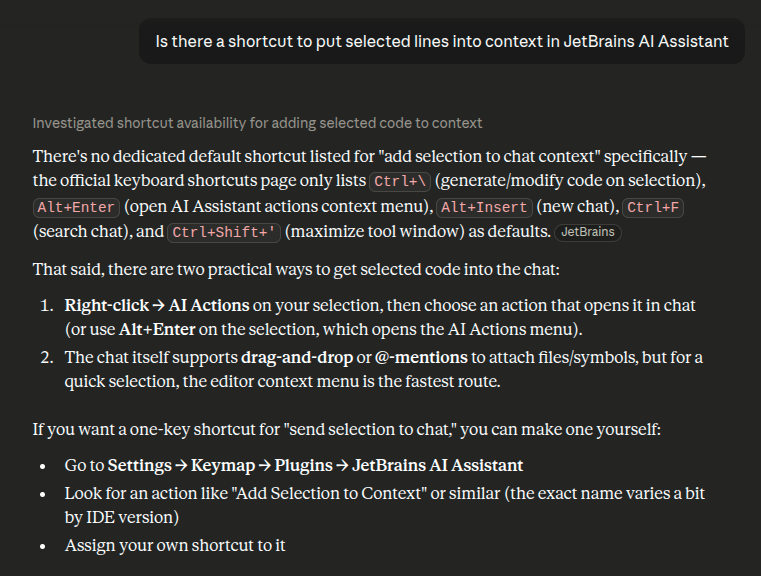

---

## Web browser prompt (2)

Usually gives quick validation for:

- Ideas, assumptions \
  *What is an LRU cache mostly used for?*
- Assessing feasibility \
  *Can I implement a 3D game in python?*
- Technology questions \
  *What libraries are there to work with geospatial data in ruby?*
- Design patterns \
  *What are the best practices for designing a REST API?*
- One time operations\
  *How do I setup Ollama on my local machine?*

---

## Web browser prompt (3)

Usually weaker for:

- Access to **surrounding code and context** (your repo, your local environment, your conventions)
- Cannot execute **commands, code / config files** locally, read log/error files
- **Context switching** between browser / CLI / IDE. the human is the copy/paste robot

---

## CLI and IDE Extensions

Many popular IDEs now have extensions that allow you to interact with LLMs directly from your editor.

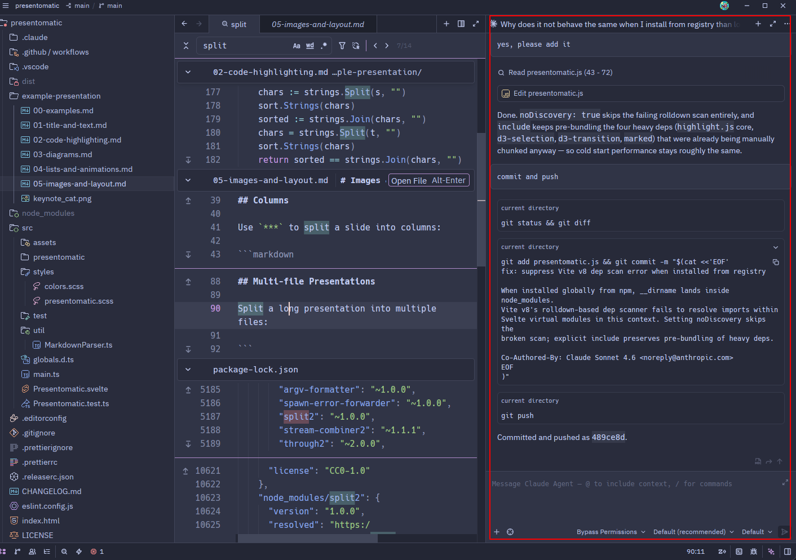

---

## General tips in CLI and IDE extensions

- Use `@<FILE>` to add a specific file as context
- Use `/` to trigger commands and skills (e.g. `/help`, `/clear`, `/review`)
- Attach images or screenshots directly into the chat (most tools support drag & drop or paste)
- Start a new conversation to reset context when switching tasks
- Be as specific as possible: "refactor this function to reduce nesting" beats "improve this"
- When the context window limit is reached, **compacting** will occur!

---

## VS Code

Usually via extensions:

- Claude
- OpenCode
- ...

Inline suggestions out-of-the-box (via GitHub Copilot).

***

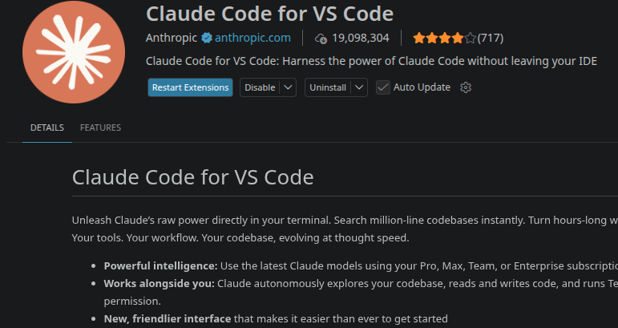

---

## VS Code specific tips

**Selected text in the editor** is automatically sent as context to the
LLM. If no lines are selected, the currently open file will be sent as context.

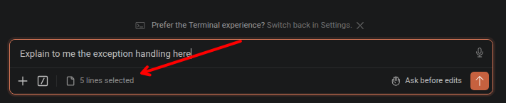

---

## JetBrains

JetBrains has its own "AI Assistant" plugin, which supports:

- Junie (JetBrains AI)
- OpenAI Codex
- Claude Agent
- Others via ACP

***

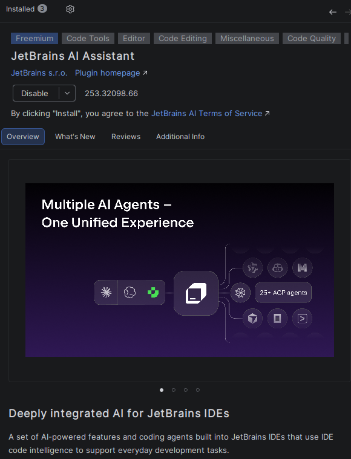

---

## JetBrains AI Assistant specific stuff

- Selected text is not automatically put to context, also there is no keyboard shortcut to do so.

---

## Zed

Zed is a minimal rust based editor. With some AI features out of the box.

***

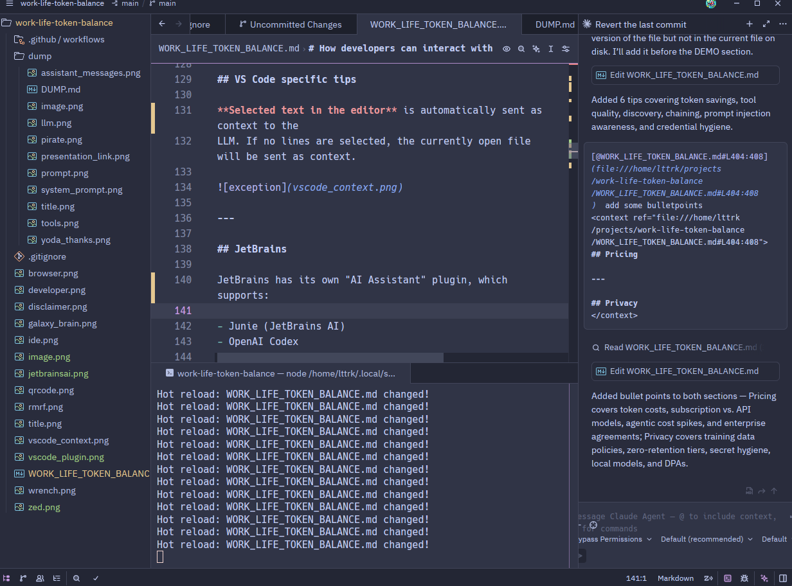

---

## Zed specific stuff

- Selected text in editor doesn't get put into the context of the LLM either
- But there's a dedicated shortcut reference the lines (`CTRL+Shift+>`)

---

## Plan vs. other modes

- **Plan mode** - the agent generates a plan of what to do before making any changes
- **Other modes** - the agent has some autonomous permissions

Other modes include:

- Ask before edits
- Edit automatically
- Auto mode
- Bypass all permissions (YOLO mode)

---

# What can LLM do with CLI / IDE integration?

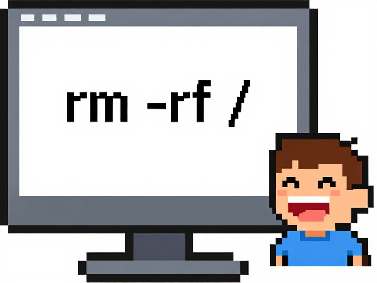

---

## Developers can focus more time in the code base itself

- **Knows your codebase** — reads files, symbols, and project structure directly
- **Executes commands** — runs tests, builds, linters, and scripts on your behalf
- **Reads local context** — access logs, error traces, and config files without copy/pasting
- **Edits files directly** — applies changes inline instead of you having to transfer code manually
- **Stays in your flow** — no context switching between browser and editor
- **Works with private code** — nothing leaves your machine unless you choose it

---

## OMG! are there any guardrails?!

- **Permission prompts** — destructive or irreversible commands (e.g. `rm`, `git push`) require explicit user approval before running
- **Diff review** — file edits are shown as diffs so you can inspect and reject changes before accepting
- **No auto-push** — the agent won't push to remote or open PRs unless you ask it to
- **Scoped context** — the agent only reads files you've shared or that are in the working directory
- **You stay in control** — the agent proposes, you decide; it does not act autonomously by default

---

## Smaller code changes, refactors

```
Extract the retry logic in api_client.rb into a separate module and add exponential backoff
```

---

## Write tests

```
Write unit tests for the UserService class covering the happy path and edge cases for invalid input
```

---

## Explaining

```
Explain what this file does and why the locking mechanism is needed here
```


---

## Analysing

```
Look at this stack trace and the relevant source files, and tell me what is causing the NullPointerException
```


---

## Reviewing

```
Review the changes on this branch and flag any bugs, security issues, or missing edge cases
```

---

## Write documentation

```
Generate a README for this project that explains what it does, how to run it, and how to contribute
```

---

## Draw diagrams

```
Create a funny MermaidJS pie chart
```

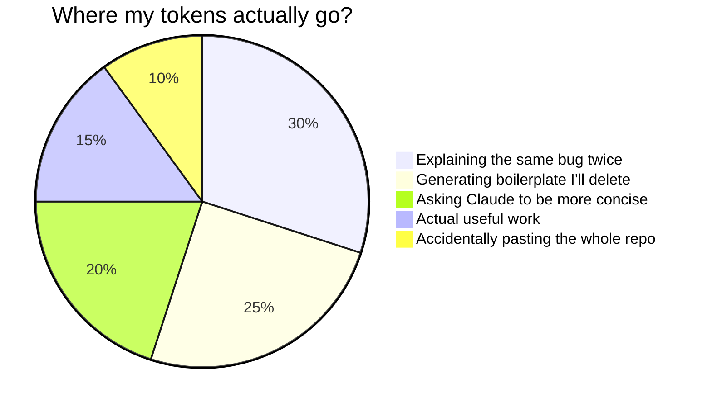

---

## I'm too lazy to RTFM of git

- `Revert the last commit`
- `Commit and push`
- `Rebase this on develop branch and fix conflicts`

---

# Skills (Claude only)

---

## Skills

Skills are reusable, named prompts or workflows you invoke with a slash command (e.g. `/code-review`, `/security-review`) — they encode expert knowledge so you don't have to re-explain the same task every time. They are a **Claude Code-specific** feature; OpenCode does not currently support skills.

---

## How to define skills

Create a Markdown file — the filename becomes the slash command:

| Scope   | Path                                      |
|---------|-------------------------------------------|
| Project | `.claude/commands/<skill-name>.md`        |
| User    | `~/.claude/commands/<skill-name>.md`      |

You can invoke a skill by typing `/<skill-name>` in the chat input.

---

## Out-of-the-box

| Skill | What it does |
| --- | --- |
| `/init` | Generate a `CLAUDE.md` for the current project |
| `/security-review` | Security-focused review of pending changes |
| `/review` | Review a branch / PR |
| `/simplify` | Refactor changed code for clarity and efficiency |

---

## Sample skill ideas

- `/standup` — summarise yesterday's git commits into a standup update
- `/ticket $ARGUMENTS` — create a Jira ticket from a short description
- `/changelog` — generate a changelog from commits since the last tag
- `/onboard` — explain the repo structure, stack, and how to run the project to a new joiner
- `/pr-description` — draft a pull request title and body from the current diff

---

# The next level: Tell the LLM how to work with **YOU**

---

## User instructions

Instructions that apply across **all your projects**:

| Tool        | Path                           |
|-------------|--------------------------------|
| Claude Code | `~/.claude/CLAUDE.md`          |
| OpenCode    | `~/.config/opencode/AGENTS.md` |

---

## Project specific instructions

Instructions scoped to a **specific project** (commit these to the repo):

| Tool        | Path                                   |
|-------------|----------------------------------------|
| Claude Code | `./CLAUDE.md` or `./.claude/CLAUDE.md` |
| OpenCode    | `./AGENTS.md`                          |

---

## Ideas for Instructions

- **Coding conventions** — naming style, file structure, preferred patterns
- **Tech stack** — language versions, frameworks, key libraries in use
- **How to run the project** — build, test, and lint commands
- **What to avoid** — deprecated APIs, banned patterns, files not to touch
- **Review checklist** — what to always check before committing (tests, docs, migrations)
- **Domain glossary** — project-specific terms and their meaning
- **Branch / PR conventions** — naming rules, commit message format
- **Personas** — tone and style when answering, generating docs or commit messages!

---

## Personas

- If you don't like the overly positive or reinforcing tone, tell the model to be more critical, or tell you more directly if it is unsure.
- Ask it to push back and flag disagreement instead of just agreeing with you
- Set a verbosity level — "terse, no preamble" vs. "explain trade-offs as you go"
- Give it a reviewer role — "review this like a security engineer" / "like a senior staff engineer doing a perf review"
- Match it to your own level — "explain like I'm new to this stack" vs. "skip the basics, I know this codebase"
- Ban filler — no emojis, no "Perfect!"/"Absolutely right!", no summary recap at the end
- Set a default stance — favor simple solutions over clever ones, ask before introducing new dependencies

---

## ... the instructions don't write themselves, do they?

After a agentic session, you can tell it to update the instructions based on what you learned together!

---

## Advantages when using instructions

- **Fewer lookups** — the agent knows your stack upfront and won't ask how to run tests or where config lives
- **Less back-and-forth** — conventions are set once; you don't need to repeat them every session
- **Consistent output** — code style, naming, and structure stay uniform across all interactions
- **Shared with the team** — committing `CLAUDE.md` means every developer gets the same agent behaviour
- **Saves tokens** — no need to re-explain context in every prompt, keeping conversations focused
- **Faster onboarding** — new team members get project conventions explained by the agent for free

---

## Tips for writing instructions

- **Be specific** — vague instructions produce vague behavior; name files, functions, or patterns explicitly
- **Reference files directly** — use `@filename` or paste the path so the model can read current content rather than relying on your paraphrase of it
- **Include examples** — show a before/after or a sample output; one concrete example beats three sentences of description
- **State constraints, not just goals** — say what to *avoid* (e.g. "don't modify tests", "keep the existing API surface") as well as what to do
- **Separate concerns** — one instruction per bullet; bundled instructions get partially ignored

---

# Plug your LLM to the outside world: MCPs

---

## What is MCP?

MCP: Model Context Protocol

*Standardized Interface for LLMs to the outside world*

---

## MCP frameworks

| Language | Framework |
|----------|-----------|
| Python | [`fastmcp`](https://gofastmcp.com/) |
| Node.js | [`@modelcontextprotocol/sdk`](https://github.com/modelcontextprotocol/typescript-sdk) |
| Go | [`mark3labs/mcp-go`](https://github.com/mark3labs/mcp-go) |
| Rust | [`rmcp`](https://github.com/modelcontextprotocol/rust-sdk) |

---

## Contents of an MCP

- Set of tools
- Set of prompts

---

## Tools

A MCP tool is basically a description of a function and its parameters and its implementation.

```python
@mcp.tool(
    title="How Far Is It?",
    description=(
        "Calculate the straight-line (great-circle) distance between two places. "
        "Accepts any place name, city, address, or landmark. "
        "Returns the distance in both kilometres and miles."
    ),
    annotations=ToolAnnotations(
        readOnlyHint=True,
        destructiveHint=False,
        idempotentHint=True,
        openWorldHint=True,
    ),
)
def how_far_is_it(from_place: str, to_place: str) -> str:
    ...
```

---

## Prompts

```python
@mcp.prompt(
    title="Pirate mode",
    description="The LLM talks like a pirate.",
)
def pirate_mode() -> str:
    """Talk like a pirate."""
    return "Talk like a pirate and include a pirate-themed joke or pun in your response. Do not use any tools from this mcp."

```

---

# Nice, but what can it really do?

---

## Useful MCPs for devs

- Atlassian MCP
- GitHub MCP
- Gitlab MCP
- AWS MCP
- Context7 MCP

---

## Tips for working with MCPs

- Save tokens by disabling MCPs you don't need for the current task
- Prefer MCPs with **focused, well-named tools** — a bloated MCP wastes context on tool descriptions the model never uses
- **Read the tool list** before a session: knowing what's available helps you ask for exactly the right thing
- Chain MCPs together — e.g. fetch a Jira ticket, look up the related GitHub PR, then post a comment back, then play "We are the champions" on my computer

---

## DEMO

---

# Considerations for enterprisey setups

---


## Pricing

- Most tools charge per **token** (input + output) — costs add up fast with large context windows
- Agentic loops can burn tokens quickly — a single session with many tool calls can cost several dollars

---

## Pricing tiers

| Tool | Plan | Price |
|------|------|-------|
| claude.ai | Pro | $20/mo ($100/mo max) |
| claude.ai | Team | $30/user/mo |
| GitHub Copilot | Individual | $10/mo |
| GitHub Copilot | Business | $19/user/mo |
| GitHub Copilot | Enterprise | $39/user/mo |
| Cursor | Pro | $20/mo |
| Cursor | Business | $40/user/mo |
| Windsurf | Pro | $15/mo |
| OpenAI API | Pay-per-token | — |
| Anthropic API | Pay-per-token | — |

---

## Token limit handling

- **Claude Code / claude.ai** — subscription includes a usage quota that resets on a rolling 6-hour window; heavy agentic use can hit the ceiling mid-session
- **GitHub Copilot** — subscription covers completions and chat; premium model requests (GPT-4o, Claude) have a monthly cap, then fall back to a base model
- **Cursor / Windsurf** — subscription includes a fixed number of "fast" (premium model) requests per month; once exhausted, requests slow-route to a cheaper model or stop
- **API (Anthropic / OpenAI)** — no artificial cap; you pay for every token, so cost scales linearly with usage — budget alerts are your only guardrail

---

## Privacy

- By default, prompts sent to cloud LLMs **may be used for training** — check your provider's policy
- Enterprise/API tiers typically offer **zero data retention** and opt-out of training
- Avoid sending secrets or confidential business logic to public endpoints
- Self-hosted / local models (e.g. Ollama) keep everything on-premise — no data leaves your machine

---

## Tips for privacy

- Files outside your working directory are **never read or sent** — the agent only accesses what you explicitly share or what is in the current project folder
- Binary files, SSH keys, `.env` files, and anything listed in `.gitignore` are not automatically included in context
- Use `.agentignore` (same syntax as `.gitignore`) to exclude specific files or directories from ever being sent to the LLM — even if they are inside your working directory

---

## How I use all this stuff

- LLM does boilerplate work, I think about what to do next
- Inspiration for presentations and code reviews
- Onboarding myself on new code repositories

---

## Beyond coding agents - AI in the CI

- Sourcery - automated code review comments on every PR
- CodeRabbit - AI-generated PR summaries and review suggestions
- ContextForge - Manage MCPs for your company / team

Example: https://github.com/docker/model-runner/pull/985

---

# Thanks
